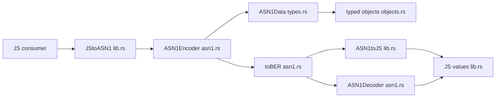

# Architecture

## Abstract

This page states how the NAPI modules of `@keetanetwork/asn1-napi-rs` collaborate on one encode and decode path. It holds the module-boundary graph and the interaction path that no single source file can show.

## Purpose

An engineer reads this page to learn how JavaScript values move through encode, BER, and decode. After reading, the engineer can name the module that owns each step and the key symbol at that step.

## Collaboration graph

`package.json` `name` is `@keetanetwork/asn1-napi-rs`. Product code lives under `src/`.

The arrows follow the runtime path a consumer uses. `JStoASN1` in `src/lib.rs` builds an `ASN1Encoder`. That encoder converts JS input through `ASN1Data` and typed objects. Bytes leave through `toBER`. Decode enters through `ASN1toJS` or `ASN1Decoder`.

## How the modules interact

A consumer encode and decode walk this path.

1. `src/lib.rs` accepts JS input through `JStoASN1`.
2. `src/asn1.rs` constructs the encoder through `ASN1Encoder::js_new`.
3. `src/types.rs` converts that JS value into internal data through `ASN1Data::try_from`.
4. `src/objects.rs` holds the typed object family, of which `ASN1OID` is the named symbol.
5. `src/asn1.rs` emits encoder bytes through `ASN1Encoder::toBER`.
6. `src/lib.rs` starts decode through `ASN1toJS`, or a caller constructs `ASN1Decoder` in `src/asn1.rs`.
7. `src/asn1.rs` classifies tags and runs decode paths on `ASN1Decoder`.
8. `src/lib.rs` returns JS shapes through `get_js_unknown_from_asn1_data`.

## Contracts that span modules

These contracts bind more than one module.

| Contract | Home |
| --- | --- |
| Package identity is `@keetanetwork/asn1-napi-rs` | `package.json` `name` |
| Encode entry is `JStoASN1`. Decode entry is `ASN1toJS` or `ASN1Decoder` | `src/lib.rs`, `src/asn1.rs` |
| Encoder bytes leave through `toBER` or `toBase64` | `ASN1Encoder` in `src/asn1.rs` |
| Typed objects carry a `type` discriminant (`oid`, `set`, `string`, `bitstring`, `context`, `date`, `struct`) | `TypedObject` and napi objects in `src/objects.rs` |
| Ava specs under `tests/` are the usage source of truth for examples | `tests/*.spec.ts` |
| Make owns build and test (`make`, `make test`, `make do-lint`, `make node_modules`) | repository `Makefile` |

## Falsified by

- A rename or removal of `JStoASN1` or `ASN1toJS` in `src/lib.rs` falsifies the encode and decode entry contract.
- A rename or removal of `ASN1Encoder::toBER` in `src/asn1.rs` falsifies the encoder output contract.
- A change to `TypedObject` discriminants or napi object `type` fields in `src/objects.rs` falsifies the typed-object contract.
- A move of usage examples off `tests/*.spec.ts` without a new cited home falsifies the usage source-of-truth contract.
- A change to `package.json` `name` falsifies package identity.
- A change to primary targets `make` / `make test` / `make do-lint` / `make node_modules` in `Makefile` falsifies the Make-owns-build contract.
