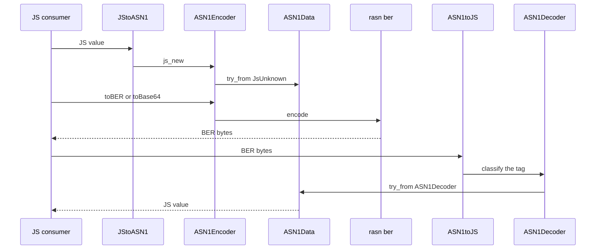
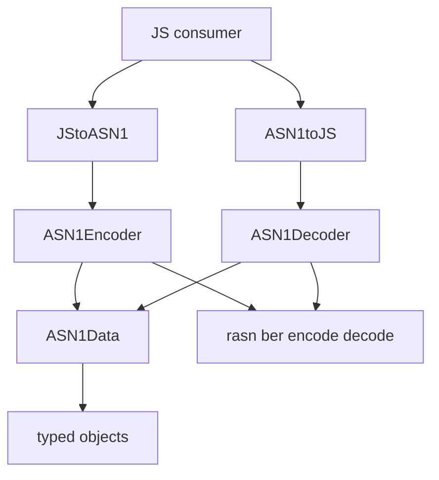

# Architecture

## Abstract

This page is the internal design of `@keetanetwork/asn1-napi-rs`. The package turns JavaScript values into ASN.1 BER and back through NAPI. It states which decisions the JS entries keep, which ones `ASN1Data` keeps, and which ones rasn keeps.

## Purpose

An engineer reads this page before changing the encode entry, the decode promotion of integers, the typed-object `type` field, or the rasn encode and decode path. After reading, the engineer can name the decision that each constraint protects and the failure that follows when the constraint is removed.

## The JS, NAPI, and Rust split

`JStoASN1` in `src/lib.rs` is the consumer encode entry. It constructs `ASN1Encoder` through `ASN1Encoder::js_new` in `src/asn1.rs`. `ASN1toJS` in `src/lib.rs` is the consumer decode entry. It constructs `ASN1Decoder` and then `ASN1Data::try_from`. A caller may also construct `ASN1Decoder` and call a typed method such as `intoInteger`. The split between those entries and the Rust types is the load-bearing part of this package.

| Decision | Owner |
| --- | --- |
| How a JS consumer starts encode | `JStoASN1` in `src/lib.rs` |
| How a JS consumer starts decode | `ASN1toJS` in `src/lib.rs`, or the `ASN1Decoder` constructor in `src/asn1.rs` |
| How a JS value becomes internal data | `ASN1Data::try_from` from `JsUnknown` in `src/types.rs` |
| How BER bytes become internal data | `ASN1Data::try_from` from `ASN1Decoder` in `src/types.rs` |
| How BER bytes leave the encoder | `toBER` and `toBase64` on `ASN1Encoder` in `src/asn1.rs` |
| How rasn writes and reads `ASN1Data` | `Encode` for `ASN1Data` in `src/objects.rs`, and `ASN1Decoder::decode` in `src/asn1.rs` |
| How a typed JS object is recognized | The `type` field and `TypedObject` in `src/objects.rs` |

`ASN1Data` in `src/types.rs` is the bridge enum. The source names it that way. `ASN1Encoder` stores one `ASN1Data` value. `toBER` and `toBase64` both call `ASN1Encoder::encode`, which runs rasn `ber::encode`. `ASN1toJS` builds `ASN1Decoder`, converts it to `ASN1Data`, and returns JS through `get_js_unknown_from_asn1_data` in `src/lib.rs`.



A decode failure from rasn becomes `ASN1NAPIError::MalformedData` in `ASN1Decoder::decode`. An encode failure becomes `ASN1NAPIError::InvalidDataEncoding` in `ASN1Encoder::encode`. Those variants live on `ASN1NAPIError` in `src/lib.rs`.

## Typed objects and primitives

A JS primitive becomes an `ASN1Data` variant without a `type` field. A JS object that carries `type` becomes `ASN1Data::Object`. `ASN1Object::try_from` in `src/objects.rs` reads that field first and then builds `ASN1OID`, `ASN1Set`, `ASN1String`, `ASN1Date`, `ASN1RawBitString`, `ASN1Context`, or `ASN1Struct`. The `type_object!` macro in `src/macros.rs` sets each `TypedObject::TYPE` string.

| Constraint | Rejected default | Why |
| --- | --- | --- |
| A typed object carries a `type` discriminant | Infer OID, set, or string from property names alone | `ASN1Object::try_from` matches `type` first. An unknown string becomes `UnknownObject` |
| An OID accepts a catalog name or a dotted string | Accept only numeric object identifiers | `NAME_TO_OID_MAP` in `src/objects.rs` encodes names such as `sha256`. `TryFrom<&str>` for `ASN1OID` also accepts a dotted string that `Oid::new` takes. `tests/object.oid.spec.ts` uses both |
| Decode of a known OID prefers the catalog name | Always return the dotted form | `TryFrom<&[u32]>` for `ASN1OID` looks up `OID_TO_NAME_MAP` before it joins words with dots |
| Sequences walk through `ASN1Iterator` | Build every JS element before the consumer starts | `src/asn1.rs` states that the iterator stays lazy so the walk stays O(n) on consume |
| JS objects are built by hand on the way out | Return a napi wrapper instance | `get_js_obj_from_asn_object` in `src/lib.rs` states that wrapping those native objects yields empty JS objects |

`NAME_TO_OID_MAP` and `OID_TO_NAME_MAP` are the two `phf` maps in `src/objects.rs`. A name that is not in the catalog and is not a dotted OID raises `ASN1NAPIError::UnknownOid`.

## Integer promotion

`ASN1Data::try_from` from `JsUnknown` stores a JS number as `ASN1Data::Integer` and a JS BigInt as `ASN1Data::BigInt`. Decode through `ASN1toJS` does not return a JS number. `TryFrom<(Env, ASN1Data)>` for `JsValue` in `src/types.rs` promotes `ASN1Data::Integer` through `ASN1IntegerToBigInt`. `tests/integer.spec.ts` requires `ASN1toJS(JStoASN1(v).toBER())` to equal `BigInt(v)`.

`ASN1Decoder.intoInteger` stays on `i64`. That path is the typed decoder method. `ASN1toJS` is the path that must survive integers that do not fit a JS number.

## Tag classification

`ASN1Decoder::new` in `src/asn1.rs` reads the first BER byte and sets `Tag` and `JsType`. Universal and context classes keep their class. Application and Private ranges become Universal because `From<Tag>` for `JsType` in `src/types.rs` still has `todo!()` for those two classes. Decode therefore continues instead of panicking on those tags.

```mermaid
stateDiagram-v2
	[*] --> st_bytes: ASN1Decoder::new
	st_bytes --> st_tag: first byte selects Tag and JsType
	st_tag --> st_data: ASN1Data::try_from
	st_data --> st_js: get_js_unknown_from_asn1_data
	st_js --> [*]
	st_tag --> st_fail: rasn decode returns MalformedData
	st_fail --> [*]
```

## Decisions

| Decision | Alternative rejected | Why |
| --- | --- | --- |
| One `ASN1Data` enum is the bridge | Parallel JS and rasn types that convert at each call | The encoder stores `ASN1Data`. The decoder produces `ASN1Data`. rasn encode and decode run on that enum |
| `JStoASN1` returns an `ASN1Encoder` instance | Return BER bytes from the entry | The consumer then chooses `toBER` or `toBase64`. Both call the same `encode` |
| `ASN1toJS` accepts ArrayBuffer, Buffer, a number array, base64, hex, or null | One byte-source type only | `asn1_to_js` matches `ValueType`. A string tries base64 and then hex through `TryFrom<&str>` for `ASN1Decoder` |
| Decode integers through `ASN1toJS` as BigInt | Return a JS number when the value fits `i64` | A JS number loses integers past 53 bits. `tests/integer.spec.ts` encodes that promotion |
| Errors are `ASN1NAPIError` variants | Surface rasn strings as the public error | Encode maps failure to `InvalidDataEncoding`. Decode maps failure to `MalformedData` |
| The Makefile appends `ASN1AnyJS` after napi emit | Hand-write `index.d.ts` | napi-rs emits the classes and object types. The `index.js` rule then appends the consumer union |

## Invariants

Each invariant below spans more than one file, which puts it beyond the reach of any single source comment.

| Invariant | Enforced at | Failure it prevents |
| --- | --- | --- |
| Encode and decode share `ASN1Data` | `ASN1Encoder` in `src/asn1.rs`, `TryFrom` in `src/types.rs`, and `Encode` for `ASN1Data` in `src/objects.rs` | Encode writes a shape that decode cannot read |
| A JS number that encodes through `JStoASN1` decodes through `ASN1toJS` as BigInt | `TryFrom<(Env, ASN1Data)>` in `src/types.rs`, checked by `tests/integer.spec.ts` | A later consumer treats the value as a number and loses high bits |
| A typed object carries `TypedObject::TYPE` | `type_object!` in `src/macros.rs` and `TryFrom<JsObject>` for `ASN1Object` in `src/objects.rs` | A plain object encodes under the wrong ASN.1 tag |
| A catalog OID name encodes to the same BER as its dotted form | `NAME_TO_OID_MAP` and `OID_TO_NAME_MAP` in `src/objects.rs`, checked by `tests/object.oid.spec.ts` | `sha256` and `2.16.840.1.101.3.4.2.1` diverge |
| A rasn encode failure becomes `InvalidDataEncoding` | `ASN1Encoder::encode` in `src/asn1.rs` | A rasn error leaves NAPI as an untyped failure |
| A rasn decode failure becomes `MalformedData` | `ASN1Decoder::decode` in `src/asn1.rs` | Malformed BER appears as a successful empty value |

## Collaboration



Inbound: a JS consumer or an Ava spec under `tests/` calls `JStoASN1` or `ASN1toJS`. `@keetanetwork/node` is the package this addon was built to serve. [Quickstart](QUICKSTART.md) holds the fenced first-use calls.

Outbound: rasn `ber::encode` and `ber::decode` produce and consume BER. napi-rs emits `index.js`, `index.d.ts`, and the `.node` addon. The Makefile `index.js` rule appends `ASN1AnyJS`. GitHub Packages is the publish registry that [Quickstart](QUICKSTART.md) states as the install gate.
